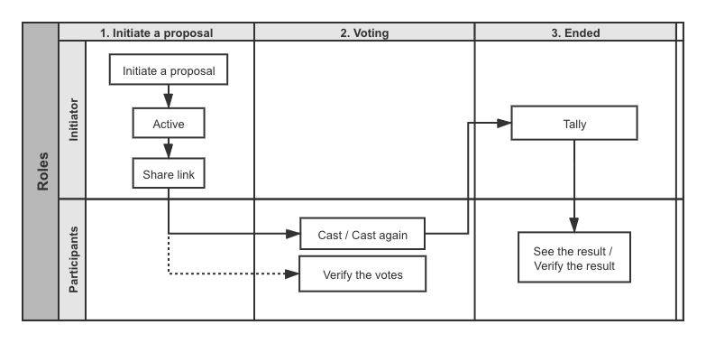
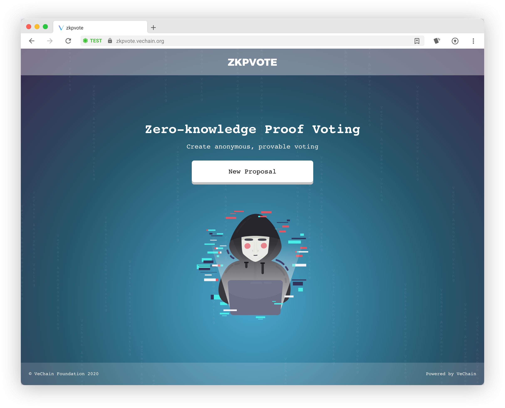
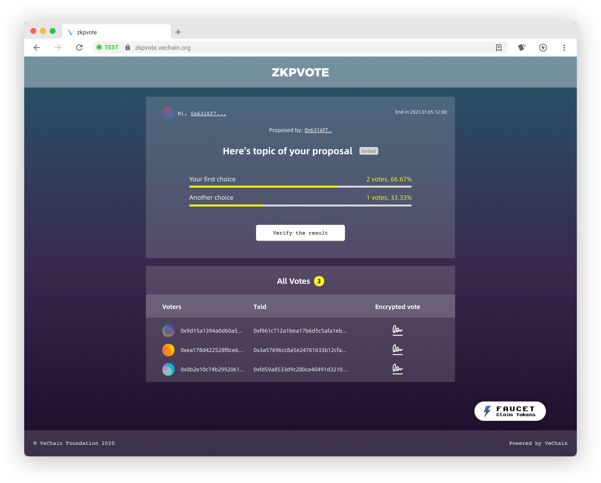

# ZKPVote

An open source interface for ZKPVote - a serverless voting application in which no one except the voting authority knows the ballot contents.

- Ballot verifiable
    - Voters can verify the existence of their ballots.
    - Anyone can verify the validity of a recorded ballot.
    - Recorded ballots are immutable.
- Tally results universally verifiable
    - Anyone can verify that all and only the valid ballots have been tallied.
    - Anyone can verify the correctness of the tally results.
- Voters are allowed to cast multiple times and the newer ballot will replace the previous one cast by the same voter.

## Demo website
- **Website**: [zkpvote.vechain.org](https://zkpvote.vechain.org/)
- **Client**: Sync. Visit [env](https://env.vechain.org/#sync) , download and install Sync.
- **Environment**: VeChainThor Blockchain Testnet
- **Claim Token**: Claim Testnet VTHO on [Faucet](https://faucet.vecha.in) to cover the transaction fee.

## Voting process and features


## ZKPVote contract

Please see the [@vechain-community/zkpvote-contract](https://github.com/vechain-community/zkpvote-contract) repository. ZKPVote is using contractV2.

## Screenshots



## Deployment

### Configuration

```yml
# Contract address
CONTRACT_ADDRESS = 0xb857ec3641ef2a7b9fc2ab4fbe3e65386df17253

# Ipfs host
IPFS_HOST = localhost

# Ipfs port
IPFS_PORT = 5001

# protocol http or https
IPFS_PROTOCOL = http
```

### Project setup

```
yarn install
```

### Compiles and hot-reloads for development

```
yarn serve
```

### Compiles and minifies for production

```
yarn build
```

### Lints and fixes files

```
yarn lint
```

### Customize configuration

See [Configuration Reference](https://cli.vuejs.org/config/).
